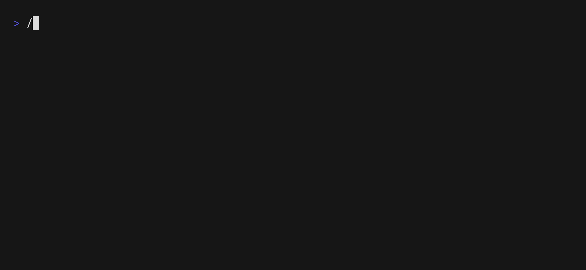

# Go Deposit CLI

CLI for generating of Bahamut chain and Ethereum 2.0 keys written in Golang

## Build

### Requirements

- go v1.23.3

### Build for Bahamut chain

```Bash
make
```

### Build for Ethereum

```Bash
make NETWORK=ethereum
```

## TODO

- [ ] Config form terminal UI

- [ ] Colorschemes

- [ ] Mnemonic input refactoring

- [ ] Password generating

- [ ] Execution and Consensus layer clients

## Deposit generating



#### Flags

- `--start-index`
	
    Aliases: `--index`,  `--start`, `--from`, `-i`

	Default: `0`

	The index of the key from which `staking-cli` will start deposits and keystores or BLS to Execution messages generating. For example, if you generated `N` keys using specific mnemonic, than for the next batch of keys you must use `--start-index=N` flag.

- `--number`

	Aliases: `--num value`, `-n`

	Default: `1`

	The number of keys (deposits and keystores, or bls-to-execution messages) that will be generated by `staking-cli` starting from `--start-index`.

- `--amounts`

	Aliases: `--amount`, `-a`

	The amount of Ehter to deposit. You can specify particular amount for each key index using `--amount=<key_index>:<amount>` as value, or set the default amount for all deposits setting `--amount=<amount>`.
    
	You can write these values in a single line manner using comma separator:

	```Bash
	--amounts="<amount_1>,<key_index_2>:<amount_2>,..."
	```

	or in a multi line manner:

	```Bash
	--amount="<amount_1>" \
	--amount="<key_index_2>:<amount_2>"
	```

	Amount value can be set with `GWEI` or `FTN`/`ETH` prefix (e.g., `1FTN`, `1ETH`, `100GWEI`), if there is no prefix the value will be accounted as `FTN`/`ETH`.

- `--withdrawal-addresses`

	Aliases: `--withdrawal-address`, `--withdraw-to`, `--w`

	The addresses that will be used as withdrawal credentials. As well as in case of `--amounts`, it is possible to specify particular address for each key (`--withdraw-to="<key_index>:<address>`) and set the default one (`--withdraw-to=<address>`). Address value in this case is 20 byte hex string.

- `--contracts` (only for Bahamut chain)

	Aliases: `--contract`, `-c`

	The contract addresses that will be used by validators for activity calculation. Unlike `--amounts` and `--withdrawal-addresses`, `--contracts` flag doesn't support a default value, so all values must be specified like this `--contract="<key_index>:<contract>"`, except the case when `--number` is equal to 1. Contract value in this case is 20 byte hex string.

- `--directory`

	Aliases: `--dir`, `-d`

	Default: `./keys`

	The directory where all generated data will be stored.

- `--keystore-kdf`

	The key derivation function, that will be used for keystore generating. There are only two possible values: `scrypt` and `pbkdf2`.

- `--chain`

	Aliases: `--network`

	Default: `mainnet`

	The chain, which configurations will be used for signing domain calculation. Bahamut chain version supports `mainnet`, `sahara` and `horizon` values, Ethereum version supports `mainnet` and `holesky` values. If you set unknown network name, you must specify `--genesis-fork`  and `--genesis-validators-root`.

- `--genesis-fork`

	The 4 byte hex string, that unique for the chain and used for signing domain calculation. 

- `--genesis-validators-root`

	The 32 byte hex string, that unique for the chain and used for signing domain calculation.

- `--password`

	The password, that will be used for keystore encryption. If `--password` is not set, `staking-cli` will ask you to enter it.

    NOTE: If you are using `--non-interactive` flag - this is a mandatory option

- `--config`

	Aliases: `--cfg`

	The config file, that will be used for deposits and keystores generating.

	Example:

	```json
	{
        "start_index": 0,
        "number": 4,
        "chain_config": {
            "name": "mainnet",
            "genesis_fork_version": "0x00004242",
            "genesis_validators_root": "0x4242424242424242424242424242424242424242424242424242424242424242"
        },
        "mnemonic_config": {
            "language": "english",
            "bitlen": 256
        },
        "amounts": {
            "default": 8192000000000,
            "config": {
                "0": 256000000000,
                "1": 4096000000000
            }
        },
        "contract_addresses": {
            "config": {
                "0": "0xdeaddeaddeaddeaddeaddeaddeaddeaddead0001",
                "1": "0xdeaddeaddeaddeaddeaddeaddeaddeaddead0002"
            }
        },
        "withdrawal_addresses": {
            "default": "0xdeaddeaddeaddeaddeaddeaddeaddeaddeaddead",
            "config": {
                "0": "0xdeaddeaddeaddeaddeaddeaddeaddeaddead0003",
                "1": "0xdeaddeaddeaddeaddeaddeaddeaddeaddead0004"
            }
        },
        "directory": "./my_keys",
        "kdf": "scrypt"
    }
	```

- `--mnemonic-bitlen`

	Aliases: `--strength`,  `--bitlen`, `--bl`, `-s`

	Default: `256`

	The strength of seed phrase, you can set it to `128`, `160`, `192`, `224`, `256`. This values affect the length of mnemonic phrase, so you will generate 12 words, 15 words, 18 words, 21 words or 24 words.

- `--mnemonic-language`

	Aliases: `--language`, `--lang`, `-l`

	Defulat: `english`

	The language of mnemonic phrase, you can generate English, Chinese Simplified, Chinese Traditional, Czech, French, Italian, Japanese, Korean, Portuguese or Spanish mnemonic.

- `--mnemonic`

    The seed phrase that will be used for keys generating. If `--mnemonic` is not set, `staking-cli` will ask you to enter it.

    NOTE: If you are using `--non-interactive` flag - this is a mandatory option

### Example

#### New Mnemonic

```Bash
./bin/staking-cli deposit \
	--start-index=0 \
	--number=4 \
	--chain="devnet" \
	--genesis-fork="0x00004242" \
	--genesis-validators-root="0x4242424242424242424242424242424242424242424242424242424242424242" \
	--amount="8192" \
	--amount="0:256FTN" \
	--amount="1:4096000000000GWEI" \
	--contract="0:0xdeaddeaddeaddeaddeaddeaddeaddeaddead0001" \
	--contract="1:0xdeaddeaddeaddeaddeaddeaddeaddeaddead0002" \
	--withdraw-to="0xdeaddeaddeaddeaddeaddeaddeaddeaddeaddead" \
	--withdraw-to="0:0xdeaddeaddeaddeaddeaddeaddeaddeaddead0003" \
	--withdraw-to="1:0xdeaddeaddeaddeaddeaddeaddeaddeaddead0004" \
	--directory="./my_keys" \
	--password="password" \
	new-mnemonic \
	--bitlen=256 \
	--language="english"
```

#### Existing Mnemonic

```Bash
./bin/staking-cli deposit \
	--start-index=4 \
	--number=4 \
	--chain="devnet" \
	--genesis-fork="0x00004242" \
	--genesis-validators-root="0x4242424242424242424242424242424242424242424242424242424242424242" \
	--amount="8192" \
	--amount="4:256FTN" \
	--amount="5:4096000000000GWEI" \
	--contract="4:0xdeaddeaddeaddeaddeaddeaddeaddeaddead0005" \
	--contract="5:0xdeaddeaddeaddeaddeaddeaddeaddeaddead0006" \
	--withdraw-to="0xdeaddeaddeaddeaddeaddeaddeaddeaddeaddead" \
	--withdraw-to="4:0xdeaddeaddeaddeaddeaddeaddeaddeaddead0007" \
	--withdraw-to="5:0xdeaddeaddeaddeaddeaddeaddeaddeaddead0008" \
	--directory="./my_keys" \
	--password="password" \
	existing-mnemonic \
	--mnemonic="abandon abandon abandon abandon abandon abandon abandon abandon abandon abandon abandon about" \
	--language="english"
```

## BLS To Execution

#### Flags

Generally `bls-to-execution` command use the same collection of flags as deposit generating command:

- `--mnemonic-language`

- `--mnemonic`

- `--start-index`

- `--number`

- `--withdrawal-addresses`

- `--directory`

- `--chain`

- `--genesis-fork`

- `--genesis-validators-root`

and two new flags:

- `--validator-indices`

	Aliases: `--validator-index`, `--indices`, `--vi`
	
	The index of the validator in the chain. As well as `--contracts`, `--validator-indices` doesn't support a default value, so all values must be specified like this `--validator-index="<key_index>:<validator_index>"`, except the case when `--number` is equal to 1. You must specify validator indices for all `N` keys starting from `--start-index` value.

 - `--config` 

	 Aliases: `--cfg`

	The config file, that will be used for BLS to Execution messages generating.

	Example:

	```json
	{
        "start_index": 0,
        "number": 3,
        "chain_config": {
            "name": "mainnet",
            "genesis_fork_version": "0x00004242",
            "genesis_validators_root": "0x4242424242424242424242424242424242424242424242424242424242424242"
        },
        "mnemonic_config": {
            "language": "english",
            "bitlen": 256
        },
        "validator_indices": {
            "config": {
                "0": 0,
                "1": 1,
                "2": 2
            }
        },
        "withdrawal_addresses": {
            "default": "0xdeaddeaddeaddeaddeaddeaddeaddeaddeaddead",
            "config": {
                "0": "0xdeaddeaddeaddeaddeaddeaddeaddeaddead0001",
                "1": "0xdeaddeaddeaddeaddeaddeaddeaddeaddead0002"
            }
        },
        "directory": "./my_bls_to_execution"
    }
	```

### Example

```Bash
./bin/staking-cli bls-to-execution \
	--start-index=0 \
	--number=3 \
	--chain="devnet" \
	--genesis-fork="0x00004242" \
	--genesis-validators-root="0x4242424242424242424242424242424242424242424242424242424242424242" \
	--validator-index="0:0" \
	--validator-index="1:1" \
	--validator-index="2:2" \
	--withdraw-to="0xdeaddeaddeaddeaddeaddeaddeaddeaddeaddead" \
	--withdraw-to="0:0xdeaddeaddeaddeaddeaddeaddeaddeaddead0001" \
	--withdraw-to="1:0xdeaddeaddeaddeaddeaddeaddeaddeaddead0002" \
	--directory="./my_bls_to_execution" \
	--mnemonic="abandon abandon abandon abandon abandon abandon abandon abandon abandon abandon abandon about" \
	--language="english"
```
